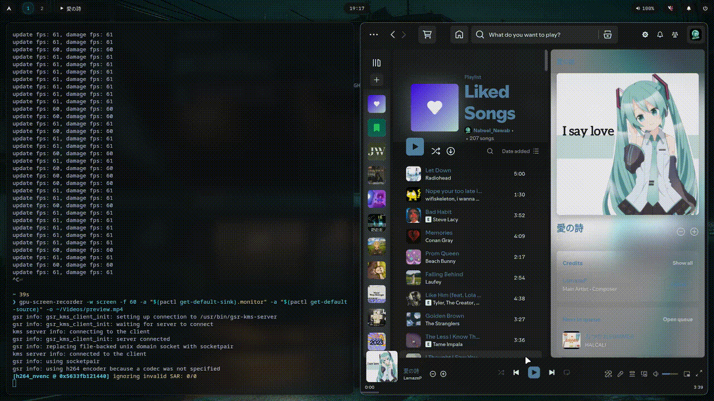
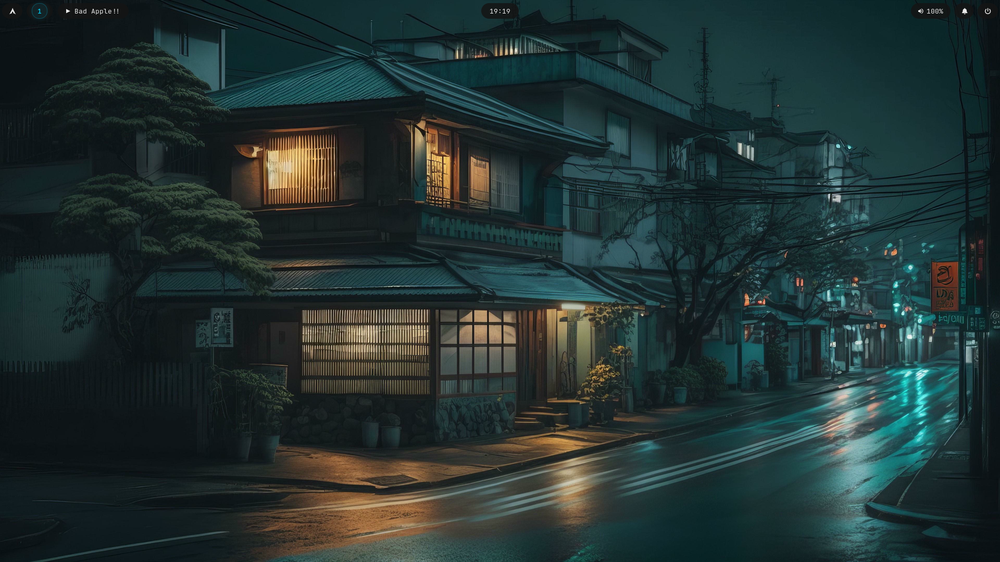
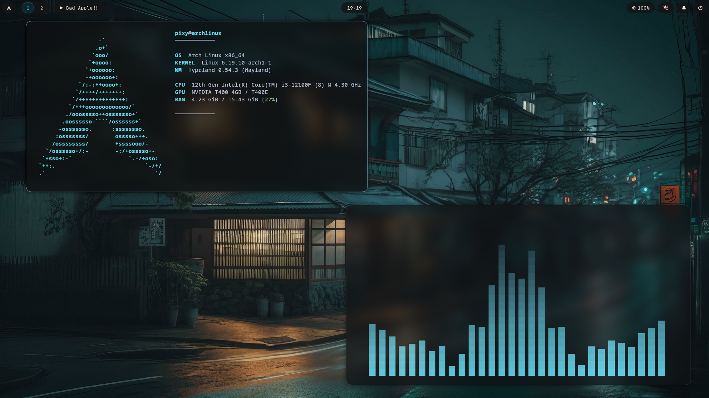
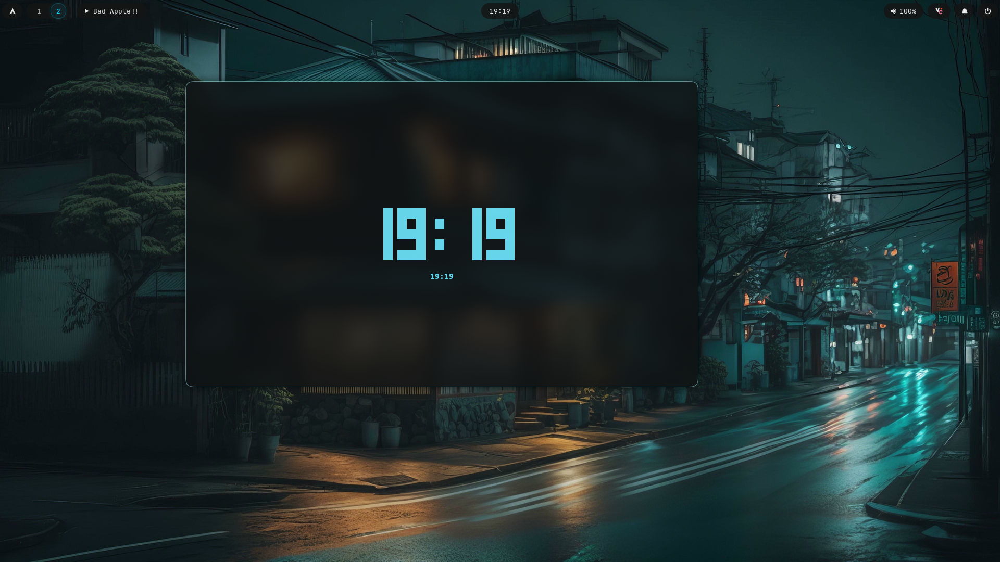
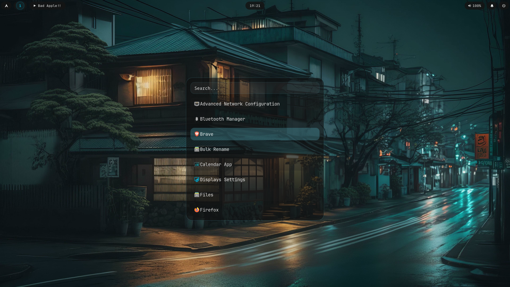
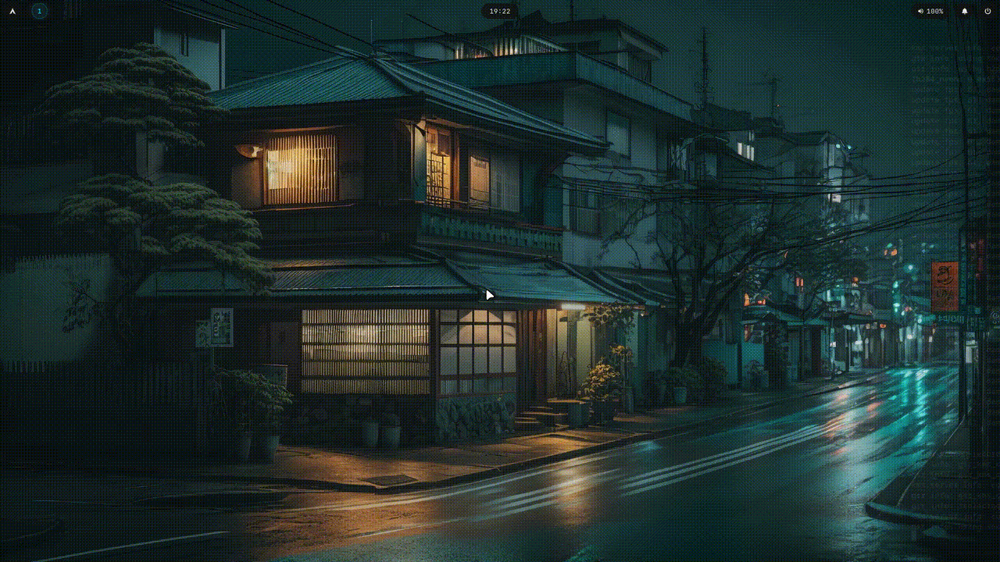

✨ My Hyprland Dotfiles

Minimal, smooth, easy-to-customize Hyprland setup.

---

🧠 About

This is my personal Hyprland setup built from scratch.

I wanted something simple that looks good and feels smooth without being overcomplicated.

- Minimal and clean design
- Fast and lightweight
- Very few external themes
- Easy to understand and modify

This setup focuses on simplicity over complexity - no unnecessary bloat, just a clean base you can build on.

---

🖼️ Preview

### Preview

 :file_folder: Click to view all screenshots

### Desktop

### Rofi

### Hyprlock

---

⚙️ Components

- WM: Hyprland
- Bar: Waybar
- Launcher: Rofi
- Lockscreen: Hyprlock
- Logout Menu: Wlogout
- Wallpaper: swww
- Notifications: swaync

---

🎨 Theming

- Minimal GTK theme
- Kvantum styling
- Custom Waybar pill design
- Cyan accent colors

---

📦 Installation

1. Clone the repository

git clone https://github.com/Nabeel3770/dotfiles.git

cd dotfiles

---

2. Run the install script

chmod +x install.sh
./install.sh

---

3. Restart your session

After installation, log out and log back in (or reboot) to apply everything.

---

4. Features
- Smooth macOS-like animations.
- Minimal glowing lockscreen.
- Dynamic wallpaper transitions.
- Clean and lightweight design.
- Very easy to customise and learn.

🧾 Notes

- Wallpapers are included in the repo
- Uses "swww" for wallpapers
- Designed for Arch Linux
- You may need small tweaks depending on your system

---

⚠️ Disclaimer

This is my personal setup, so it might not work perfectly on every system.

But everything is kept simple, so it’s easy to fix and customize.

---

🤍 Final Thoughts

This is my first Hyprland setup and I learned a lot while making it.

Feel free to use it, modify it, or build your own version from it.

---
