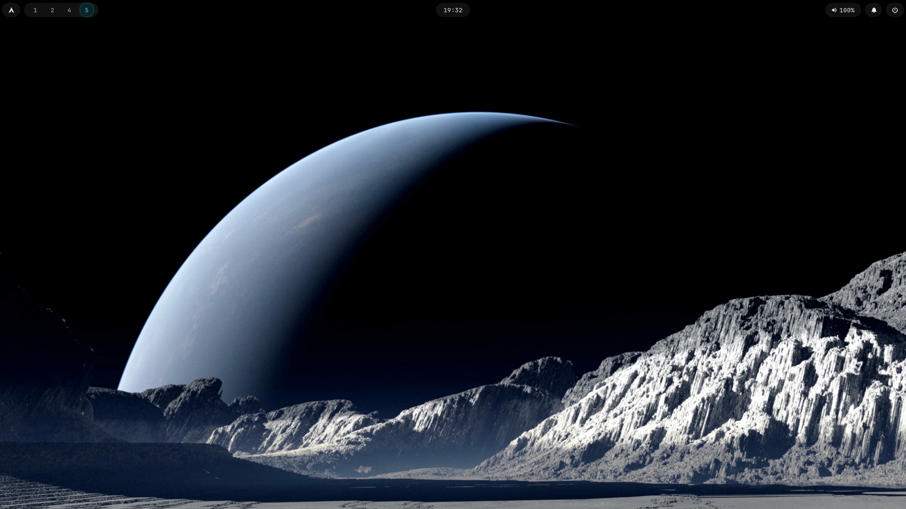
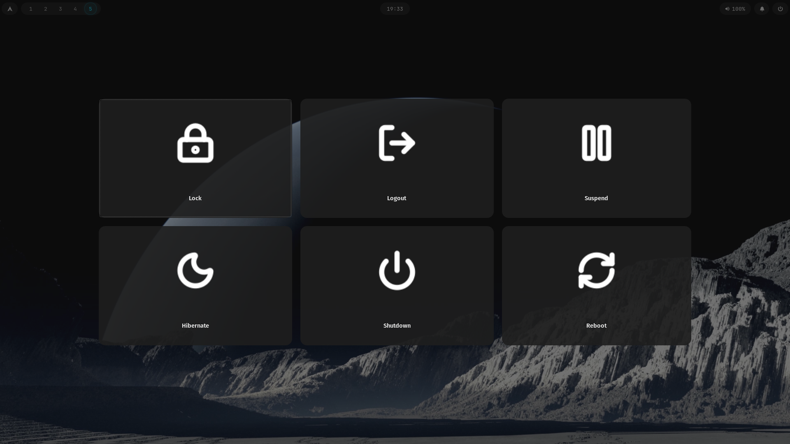

✨ My Hyprland Dotfiles

«My first ever Hyprland rice — minimal, clean, and actually usable.»

---

🧠 About

This is my personal Hyprland setup built from scratch.

- 🎯 Minimal and clean design
- ⚡ Fast and lightweight
- 🎨 Very few external themes (kept simple)
- 🧩 Easy to understand and modify

This rice focuses on simplicity over complexity — no unnecessary bloat.

---

🖼️ Preview

---

⚙️ Components

- 🪟 WM: Hyprland
- 📊 Bar: Waybar
- 🔍 Launcher: Rofi
- 🔒 Lockscreen: Hyprlock
- ⏻ Logout Menu: Wlogout
- 🖼️ Wallpaper: swww
- 🔔 Notifications: swaync

---

🎨 Theming

- GTK theme (minimal)
- Kvantum styling
- Custom Waybar pills
- Cyan accent color scheme

---

📦 Installation

Clone the repo:

git clone https://github.com/Nabeel3770/dotfiles.git
cd dotfiles

Run setup:

chmod +x install.sh
./install.sh

---

🧾 Notes

- Wallpapers are included inside the repo
- Uses "swww" for wallpaper handling
- Designed for Arch Linux
- May require minor tweaks depending on your system

---

⚠️ Disclaimer

This is my personal setup — things may not work perfectly on every system.

But it’s simple enough to fix and customize.

---

🧊 Future Improvements

- [ ] Better automation script
- [ ] Multiple theme support
- [ ] Cleaner package list
- [ ] Screenshot previews

---

🤍 Final Thoughts

This is my first Hyprland setup and I learned a lot building it.

If you like it or use it, feel free to fork or improve it.

---

⭐ If this helped you, consider starring the repo!
